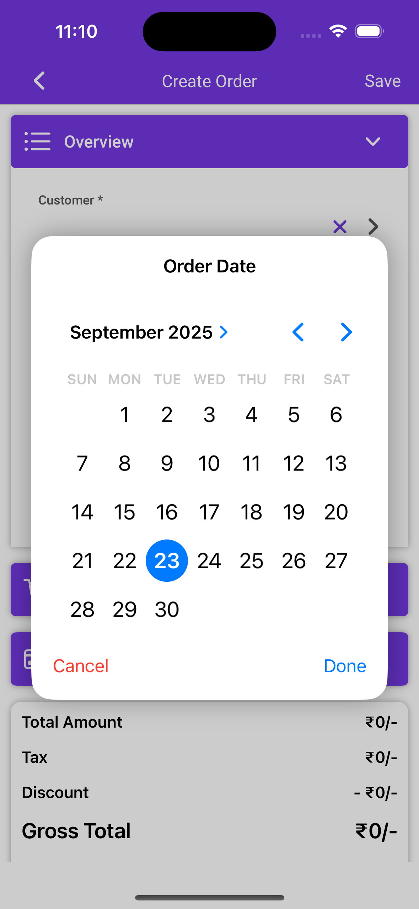
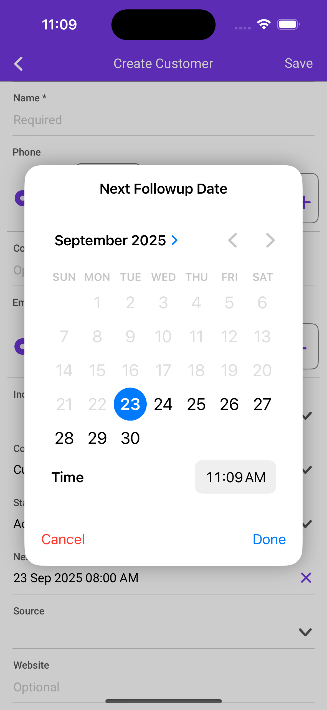
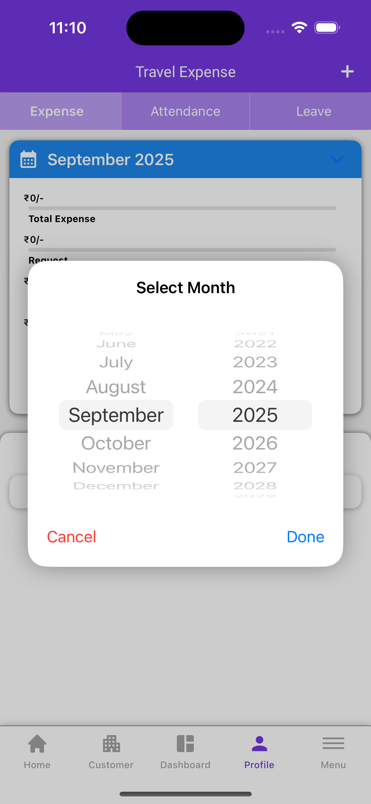

# 📅 MultiModeDatePicker

A customizable **multi-mode date picker** for SwiftUI.  
Supports multiple styles (**date, date+time, month-day, year, year+month, and time**), with optional min/max date constraints.  
Displays as a popup overlay for simple integration into any SwiftUI or UIKit project.

| Date | Date + Time | Year + Month |
|------|-------------|--------------|
|  |  |  |


[View the repository on GitHub](https://github.com/KarishmaGR/MultiModeDatePicker)

---

## ✨ Features

- 🎨 **Multiple Picker Modes**:
  - `date` (just date)
  - `dateTime` (date + time)
  - `monthDay` (month & day only)
  - `year` (year only)
  - `yearMonth` (year + month)
  - `time` (time only)
- 📌 **Min & Max Range**: Restrict selectable dates
- 🪄 **Popup Style**: Modal presentation over any view
- ✅ **Easy API**: Single method call with completion handler

---

## 📋 Requirements

- iOS 15.0+  
- Xcode 14+  

---

## 📲 Installation

### Swift Package Manager

1. In **Xcode**, go to:  
   **File → Add Packages…**
2. Enter the repo URL:  https://github.com/KarishmaGR/MultiModeDatePicker.git

3. Choose the branch (e.g. `main`) or version and add to your target.

-------

## 🚀 Usage

Import and present the picker:

```swift
import MultiModeDatePicker

// Example: Date of Birth picker
MultiModeDatePicker.showDatePicker(
 title: "Select Date of Birth",
 initialDate: Date(),
 minDate: Calendar.current.date(byAdding: .year, value: -100, to: Date()),
 maxDate: Date(),
 pickerType: .date
) { selectedDate in
 if let date = selectedDate {
     print("User selected: \(date)")
 } else {
     print("User cancelled the picker")
 }
}
